# Semantic Change Detection on SECOND: a controlled study of architectures and class imbalance

This project trains and evaluates **semantic change detection (SCD)** models on the
[SECOND](https://captain-whu.github.io/SCD/) aerial dataset. Each model answers two questions for
every pixel of a before/after image pair: *did this pixel change?* and *if so, what was it before
and what is it now?*

The project has two phases, both run under one fixed protocol so every difference in the results
comes from the thing being tested:

1. **Phase A: architecture.** Three SCD designs share the same backbone, decoder, data split,
   schedule and seed.
2. **Phase B: class imbalance.** Nine imbalance techniques are tested on the winning
   architecture.

Everything runs end to end on a 16 GB Apple M4 laptop.

**Documentation:** [Project summary](docs/PROJECT_SUMMARY.md) ·
[Methodology](docs/METHODOLOGY.md) · [Full results](docs/RESULTS.md) ·
[Diagnostics and cross-validation](docs/DIAGNOSTICS.md) · [References](docs/REFERENCES.md) ·
[Roadmap](docs/ROADMAP.md) · [Engineering notes](docs/ENGINEERING_NOTES.md)

All planned experiments are complete.

## Results at a glance

| | Test SeK | vs. Early Fusion baseline |
|---|---:|---:|
| Early Fusion + CE (starting point) | 7.97 | — |
| SSCD + CE | 13.59 | **+70.4%** |
| Bi-SRNet-lite + CE (selected architecture) | 14.24 | **+78.6%** |
| **Best overall: Bi-SRNet-lite + WCE + Dice** | **15.38** | **+92.9%** |

- **Architecture matters most.** Replacing early fusion with a Siamese design raised SeK by
  70%. Adding cross-temporal attention and a semantic-consistency
  loss (Bi-SRNet-lite) raised it by another 4.8%, with only
  0.33M extra parameters.
- **Imbalance handling gives a smaller gain.** The best technique, *WCE + Dice*, improves SeK by
  +8.0% over plain CE on the same architecture.
  6 of 9 techniques beat the CE baseline on SeK. 9 of 9 lower
  overall accuracy (OA): they trade some no-change pixels for more detected change.
- **Rare classes gain the most.** From the Early Fusion baseline to the best run, *water* IoU goes
  from 0.0 to 23.0 and *playground* IoU from 9.7 to
  32.9.
- **Most errors are missed changes, not wrong classes.** In the best run, 31% of changed
  pixels (averaged over the 6 classes) are predicted as *no-change*. Mixing up two land-cover
  classes is much rarer ([confusion matrix](#training-curves-and-error-analysis)). The change branch
  has more room to improve than the semantic branch.
- **The published ranking holds at lower cost.** Our runs keep the published order
  (HRSCD-str.2 < SSCD-l < Bi-SRNet) and reach 75% / 62% /
  61% of the published SeK. They use ¼ of the pixels (256 px instead of 512 px),
  a ResNet-18 backbone, 20 epochs and about 22 minutes of training per model on a laptop.

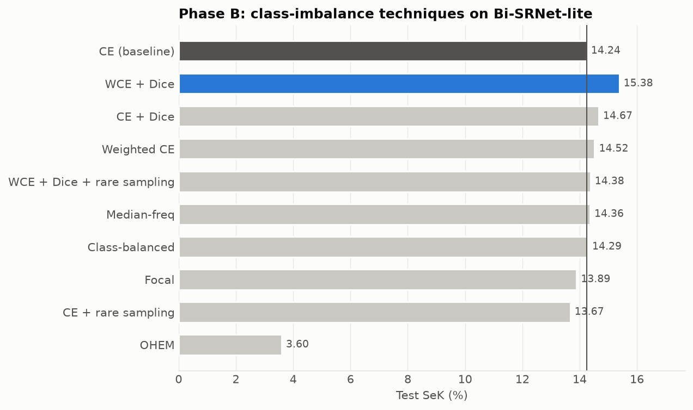

## What is different about this project

Most SCD papers propose a new network and report one number against earlier networks. This project
is a **controlled comparison** instead:

| | Typical SCD paper | This project |
|---|---|---|
| Comparison | Often against numbers reported in other papers (different code, schedules and sometimes splits) | 3 architectures, one fixed protocol: same backbone, decoder, split, seed, schedule and metric code |
| Class imbalance | Usually one loss choice, rarely compared with alternatives | Imbalance measured first (4:1 change ratio, 59× between classes, 31 transition types), then 9 techniques benchmarked |
| Balancing scope | Varies | Both branches: BCE `pos_weight`/focal/Dice/OHEM on change, class weights/Dice/focal/OHEM on semantics, plus image-level rare-class oversampling |
| Hardware | GPU training at 512 px, usually for many more epochs | One 16 GB Apple M4 laptop (MPS), 256 px, 20 epochs, ~22 min/run |
| Data handling | Download, unpack, train | 2.2 GB RAR streamed from Google Drive into a 256 px copy without writing the archive to disk; lazy PNG loading keeps RAM low |
| Reproducibility | Varies | Fixed split (seed 0), one command runs everything; docs are generated from the result files |

Design choices used in every run (standard ideas, applied consistently rather than claimed as new):

- **Temporal-swap augmentation:** T1 and T2 (and their labels) are swapped at random, so the model
  sees every change in both directions (e.g. tree → building and building → tree).
- **Cross-temporal attention with a zero-initialised gate:** training starts exactly from the SSCD
  model and learns how much attention to add.
- **Change-aware semantic loss:** semantic loss is computed only on changed pixels, as in
  Bi-SRNet, because SECOND defines semantic labels only there.
- **Model selection on a separate validation split:** checkpoints are chosen by validation SeK and
  reported once on a separate test split, so no test-set tuning.

## Pipeline

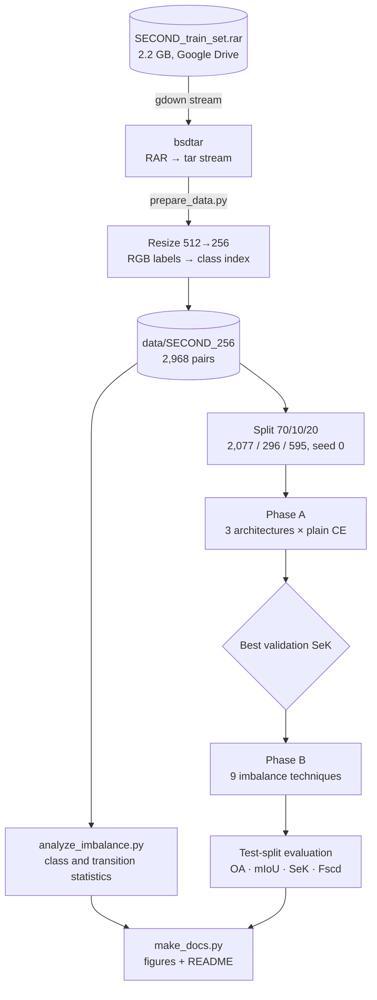

### Experiment protocol

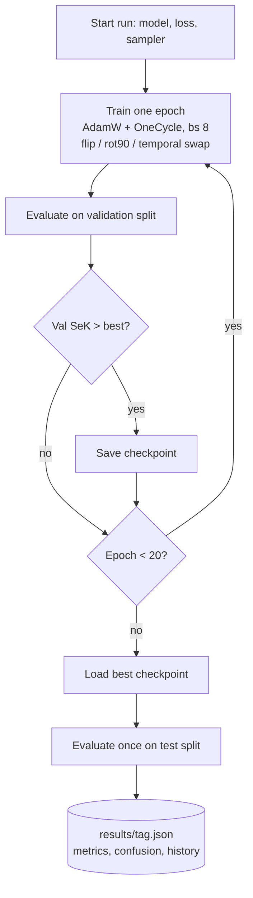

## Models

All three share an ImageNet-pretrained **ResNet-18** encoder and an FPN-style decoder (64 channels,
stride 4).

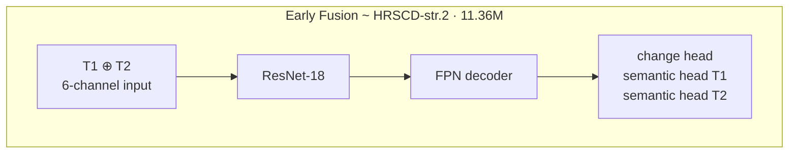

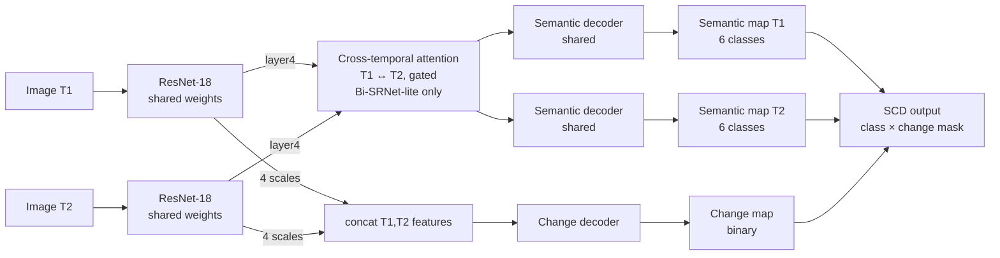

| Model | Idea | Based on | Parameters |
|---|---|---|---:|
| Early Fusion | Stack T1 and T2 as 6 channels, one network, three heads | HRSCD str.2 [[2]](https://arxiv.org/abs/1810.08452) | 11.36M |
| SSCD | Siamese encoder; semantic decoder per date (shared) + change decoder on concatenated features | SSCD-l [[3]](https://arxiv.org/abs/2108.06103) | 11.58M |
| Bi-SRNet-lite | SSCD + cross-temporal attention on the deepest features + semantic-consistency loss | Bi-SRNet [[3]](https://arxiv.org/abs/2108.06103) | 11.91M |

Encoder: ResNet-18 [[7]](https://arxiv.org/abs/1512.03385), decoder: FPN-style [[8]](https://arxiv.org/abs/1612.03144).

### Loss

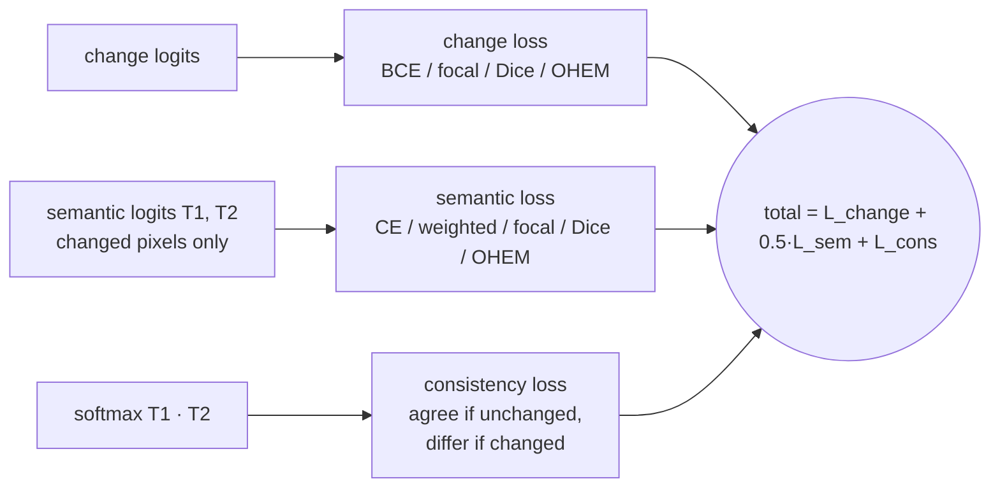

## Dataset and class imbalance

SECOND has 2,968 public 512×512 image pairs with 6 land-cover classes. Labels exist only where
change happened. Only **19.9%** of pixels change (no-change : change =
4.01 : 1). Among changed pixels, the largest class is
**59×** bigger than the smallest. *Playground* appears in only
111 of 2,968 before-images.

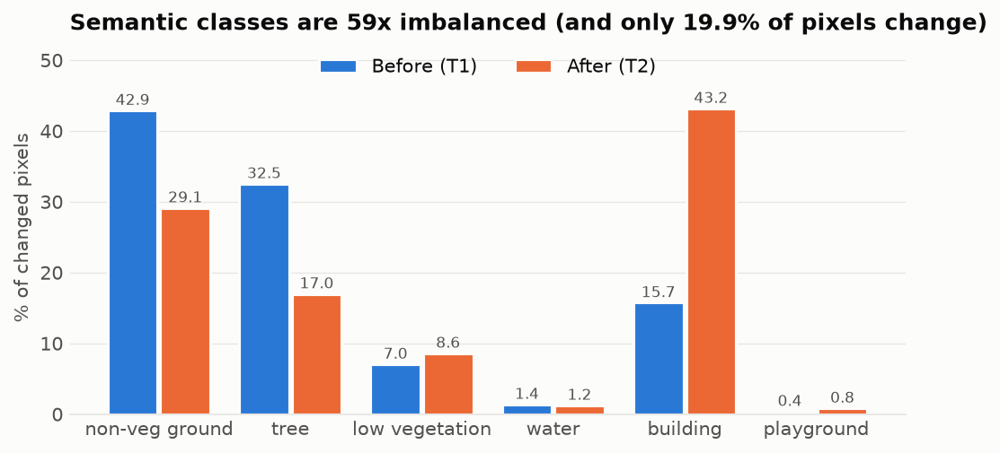

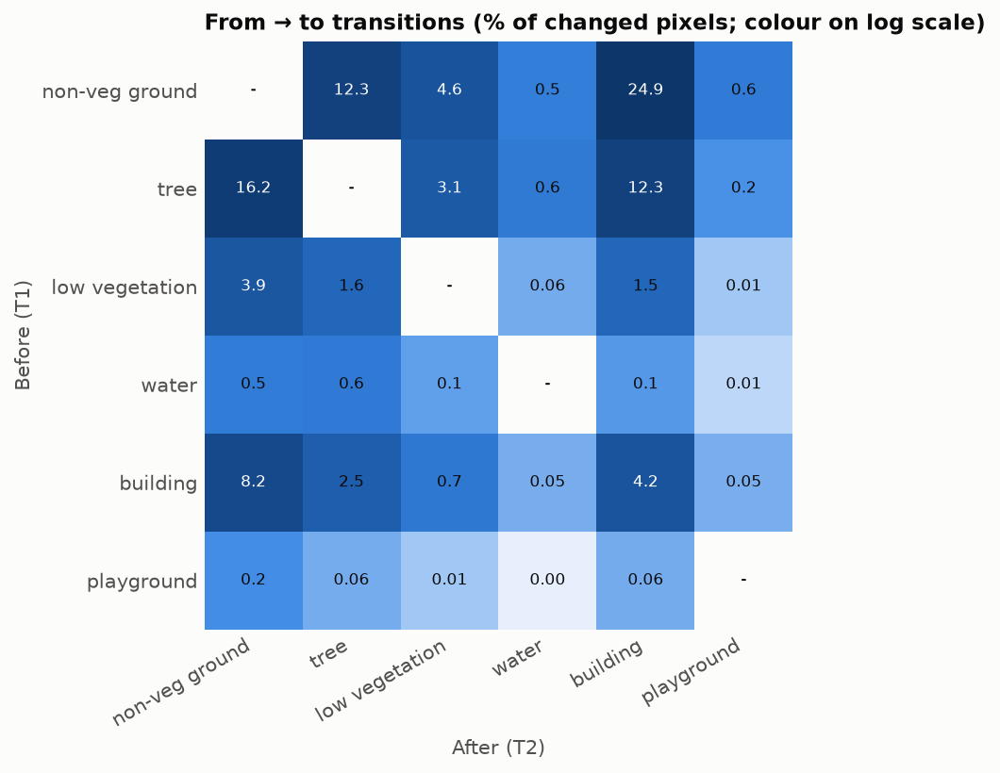

## Results

All numbers are on the held-out **test split (595 pairs)**. Checkpoints are selected by validation
SeK. SeK is the primary metric. Full tables: [docs/RESULTS.md](docs/RESULTS.md).

### Phase A: architecture (plain CE)

| Architecture | OA | mIoU | **SeK** | Fscd | Change IoU | val SeK | best ep | train min |
|---|---:|---:|---:|---:|---:|---:|---:|---:|
| Early Fusion (HRSCD-str.2-style) | 84.15 | 63.71 | 7.97 | 46.12 | 42.51 | 8.29 | 20 | 9.5 |
| Siamese SSCD (SSCD-l-style) | 85.92 | 68.02 | 13.59 | 52.48 | 49.28 | 13.67 | 15 | 21.1 |
| **Bi-SRNet-lite (SSCD + cross-temporal attention + consistency loss)** | 85.75 | 68.65 | **14.24** | 53.36 | 50.67 | 14.48 | 16 | 22.5 |

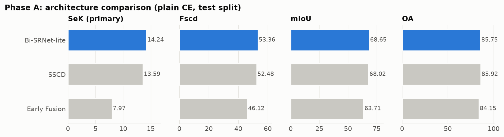

### Phase B: class-imbalance techniques on Bi-SRNet-lite

| Technique | OA | mIoU | **SeK** | Fscd | Change IoU | val SeK | best ep | train min |
|---|---:|---:|---:|---:|---:|---:|---:|---:|
| CE (baseline) | 85.75 | 68.65 | 14.24 | 53.36 | 50.67 | 14.48 | 16 | 22.5 |
| **WCE + Dice** | 84.27 | 68.97 | **15.38** | 53.88 | 52.66 | 15.54 | 19 | 24.3 |
| CE + Dice | 85.03 | 68.98 | 14.67 | 53.76 | 51.96 | 15.03 | 18 | 24.1 |
| Weighted CE | 84.04 | 68.42 | 14.52 | 53.01 | 51.77 | 15.62 | 19 | 22.2 |
| WCE + Dice + rare sampling | 84.22 | 68.50 | 14.38 | 53.04 | 51.75 | 14.99 | 19 | 23.9 |
| Median-freq | 83.13 | 68.11 | 14.36 | 51.82 | 51.86 | 14.76 | 18 | 22.6 |
| Class-balanced | 83.39 | 68.08 | 14.29 | 52.40 | 51.69 | 15.29 | 18 | 34.7 |
| Focal | 81.58 | 66.31 | 13.89 | 52.09 | 50.34 | 14.69 | 19 | 22.9 |
| CE + rare sampling | 85.13 | 67.93 | 13.67 | 53.14 | 49.96 | 14.31 | 14 | 22.6 |
| OHEM | 43.31 | 32.20 | 3.60 | 26.77 | 25.79 | 3.85 | 10 | 22.6 |

> **OHEM did not train properly** (best validation SeK 3.85, test OA 43.3%). Its default setting was not tuned for this task, so this run shows that setting failing here, not that the technique cannot work.

Relative change against the CE baseline (Δ% for metrics, percentage points for class IoU):

| Technique | ΔSeK | ΔFscd | ΔmIoU | ΔOA | ΔChange IoU | Δwater IoU | Δplayground IoU |
|---|---:|---:|---:|---:|---:|---:|---:|
| WCE + Dice | +8.0% | +1.0% | +0.5% | -1.7% | +3.9% | +3.4 pt | +3.1 pt |
| CE + Dice | +2.9% | +0.7% | +0.5% | -0.8% | +2.5% | +2.5 pt | +4.0 pt |
| Weighted CE | +2.0% | -0.7% | -0.3% | -2.0% | +2.2% | +1.3 pt | +0.0 pt |
| WCE + Dice + rare sampling | +0.9% | -0.6% | -0.2% | -1.8% | +2.1% | +3.3 pt | +9.4 pt |
| Median-freq | +0.8% | -2.9% | -0.8% | -3.1% | +2.4% | -3.3 pt | -0.6 pt |
| Class-balanced | +0.3% | -1.8% | -0.8% | -2.8% | +2.0% | -0.9 pt | +1.8 pt |
| Focal | -2.5% | -2.4% | -3.4% | -4.9% | -0.6% | +2.7 pt | +3.8 pt |
| CE + rare sampling | -4.0% | -0.4% | -1.1% | -0.7% | -1.4% | +2.4 pt | +2.9 pt |
| OHEM | -74.8% | -49.8% | -53.1% | -49.5% | -49.1% | -5.1 pt | -10.8 pt |

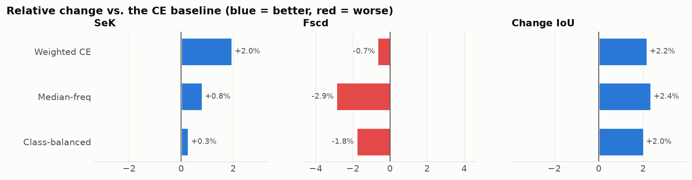

### Per-class IoU

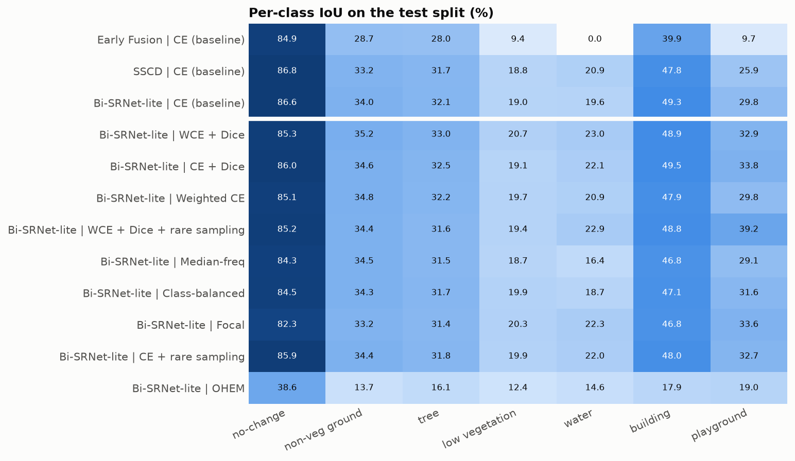

### Training curves and error analysis

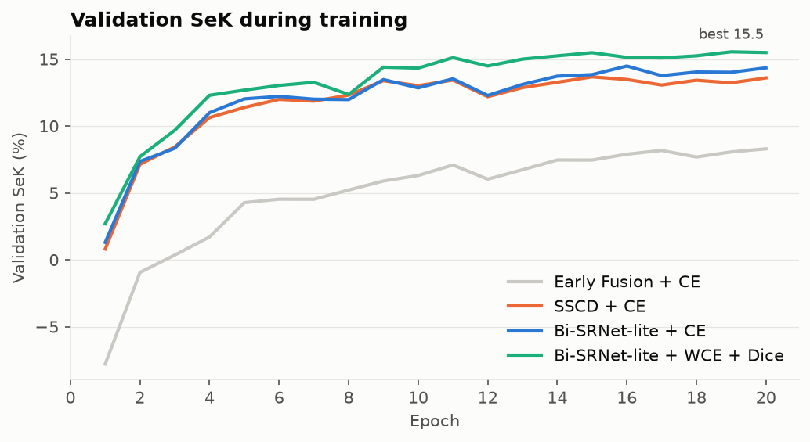

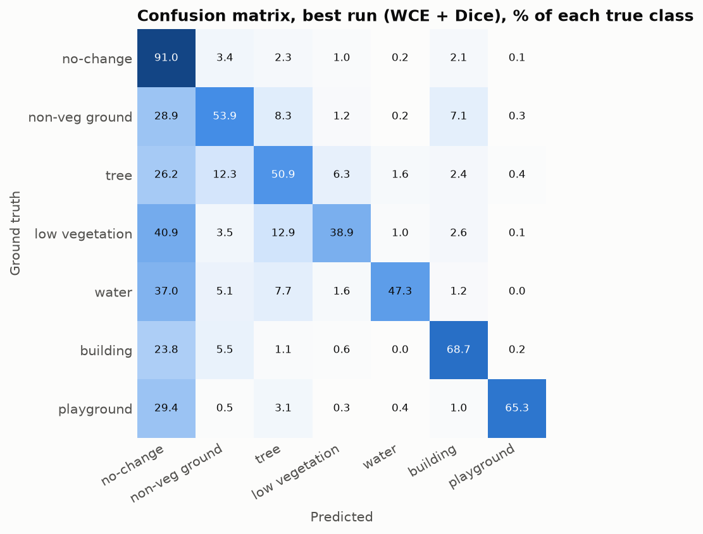

### Qualitative results

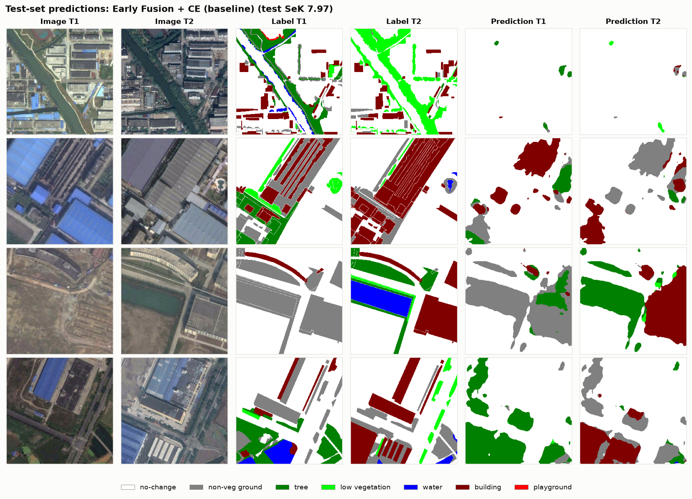

*Predictions from `B_bisrnet_combo` on test pairs. Colours follow the official SECOND legend.*

### Comparison with published results

| Method | Setting | OA | mIoU | SeK | Fscd |
|---|---|---:|---:|---:|---:|
| HRSCD-str.2 | published, 512 px | 85.49 | 64.43 | 10.69 | 49.22 |
| HRSCD-str.4 | published, 512 px | 86.62 | 71.15 | 18.80 | 58.21 |
| SSCD-l | published, 512 px | 87.19 | 72.60 | 21.86 | 61.22 |
| Bi-SRNet | published, 512 px | 87.84 | 73.41 | 23.22 | 62.61 |
| SCanNet | published, 512 px | 87.86 | 73.42 | 23.94 | 63.66 |
| ChangeMamba | published, 512 px | 88.12 | 73.68 | 24.11 | 64.03 |
| **Ours: Early Fusion** | 256 px, R-18, 20 ep | 84.15 | 63.71 | **7.97** | 46.12 |
| **Ours: SSCD** | 256 px, R-18, 20 ep | 85.92 | 68.02 | **13.59** | 52.48 |
| **Ours: Bi-SRNet-lite** | 256 px, R-18, 20 ep | 85.75 | 68.65 | **14.24** | 53.36 |
| **Ours: Bi-SRNet-lite + WCE + Dice** | 256 px, R-18, 20 ep | 84.27 | 68.97 | **15.38** | 53.88 |

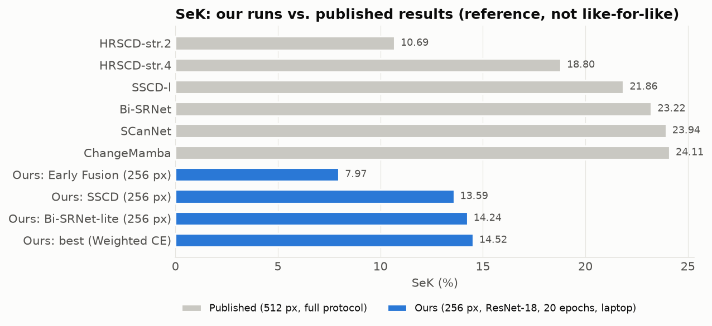

> **This comparison is not like-for-like.** Published numbers use 512×512 images, usually larger
> backbones, longer training and their own splits. Ours use 256×256 (¼ of the pixels),
> ResNet-18, 20 epochs and a 70/10/20 split of the 2,968 public pairs. The table shows where the
> results sit, not a claim to beat those methods. The main result here is the controlled
> comparison inside this project.

## Model diagnostics: errors, cross-validation and fit

### Error breakdown (main runs, test split)

Every changed pixel ends up in one of three buckets: correct class, wrong class, or missed (the
model says *no-change*). Unchanged pixels that the model marks as changed are false alarms.

| Model / technique | Correct | Wrong class | Missed change | False alarm | Change precision | Change recall |
|---|---:|---:|---:|---:|---:|---:|
| Early Fusion + CE (baseline) | 39.9% | 11.7% | 48.4% | 5.2% | 70.7% | 51.6% |
| SSCD + CE (baseline) | 46.6% | 12.0% | 41.4% | 4.6% | 75.6% | 58.6% |
| Bi-SRNet-lite + CE (baseline) | 49.2% | 12.8% | 38.0% | 5.4% | 73.4% | 62.0% |
| Bi-SRNet-lite + WCE + Dice | 56.5% | 15.8% | 27.7% | 9.0% | 65.9% | 72.3% |
| Bi-SRNet-lite + CE + Dice | 53.1% | 14.5% | 32.4% | 7.3% | 69.2% | 67.6% |
| Bi-SRNet-lite + Weighted CE | 55.2% | 15.8% | 29.0% | 9.0% | 65.6% | 71.0% |
| Bi-SRNet-lite + WCE + Dice + rare sampling | 54.6% | 15.6% | 29.8% | 8.6% | 66.3% | 70.2% |
| Bi-SRNet-lite + Median-freq | 56.3% | 17.9% | 25.8% | 10.4% | 63.3% | 74.2% |
| Bi-SRNet-lite + Class-balanced | 56.3% | 16.9% | 26.7% | 10.1% | 63.7% | 73.3% |
| Bi-SRNet-lite + Focal | 60.9% | 17.4% | 21.7% | 13.4% | 58.5% | 78.3% |
| Bi-SRNet-lite + CE + rare sampling | 50.6% | 12.8% | 36.5% | 6.5% | 70.1% | 63.5% |
| Bi-SRNet-lite + OHEM | 59.0% | 31.4% | 9.6% | 60.5% | 26.5% | 90.4% |

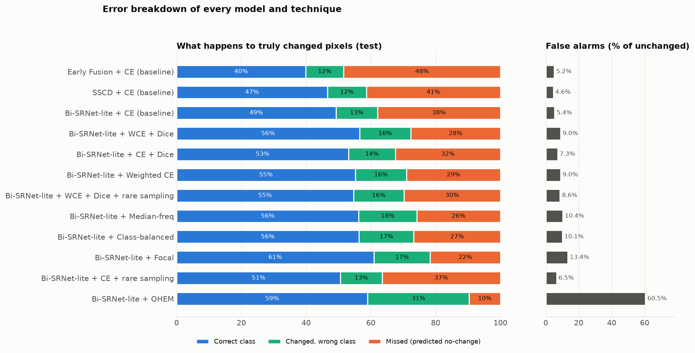

- Missed changes are a bigger error than wrong classes in **11 of 12** runs.
- Imbalance handling finds more changes but also raises false alarms. Going from plain CE to WCE + Dice on
  Bi-SRNet-lite, change recall rises from 62.0% to
  72.3%, but change precision falls from 73.4% to
  65.9%, and false alarms go from 5.4% to
  9.0% of unchanged pixels. The net effect on SeK is still positive
  (14.24 → 15.38).
- OHEM shows the extreme end of this trade: 60% false alarms.

### Cross-validation (3-fold)

The 2,373 train+validation pairs are split into 3
folds (1,582 train / 791 validation per fold). The 595-pair test split is
never used for training or model selection. Each fold's best-validation model is scored on it.
Because each fold trains on fewer pairs than the main runs (2,077), CV scores are a little lower;
they are used to measure **stability and ranking**, not to replace the main-table numbers.

- **Best by cross-validation:** Bi-SRNet-lite + WCE + Dice, test SeK 14.26 ± 0.19 over 3 folds.
- Against plain CE on the same model it wins in **3 of 3 folds** (mean +0.70 SeK, std 0.30). The gain is consistent across folds.
- Fit diagnosis: 4× mild overfitting.

| Model / technique | Val SeK | **Test SeK** | Test Fscd | Train SeK | Gap (train−val) | Val-loss rise | Diagnosis | Beats reference in |
|---|---:|---:|---:|---:|---:|---:|---|---|
| Bi-SRNet-lite + WCE + Dice | 14.96 ± 0.62 | **14.26 ± 0.19** | 52.77 ± 0.25 | 24.18 ± 0.91 | 9.22 ± 0.52 | 0.3% | Mild overfitting | 3/3 folds (+0.70) |
| Bi-SRNet-lite + CE (baseline) | 14.39 ± 0.54 | **13.55 ± 0.42** | 52.79 ± 0.52 | 23.16 ± 1.03 | 8.77 ± 0.49 | 0.8% | Mild overfitting | 3/3 folds (+6.81) |
| SSCD + CE (baseline) | 13.38 ± 0.73 | **12.97 ± 0.39** | 51.67 ± 0.50 | 25.17 ± 0.18 | 11.80 ± 0.55 | 2.8% | Mild overfitting | 3/3 folds (+6.23) |
| Early Fusion + CE (baseline) | 7.03 ± 0.28 | **6.74 ± 0.09** | 44.44 ± 0.64 | 11.78 ± 0.37 | 4.75 ± 0.49 | 0.4% | Mild overfitting | — (reference) |

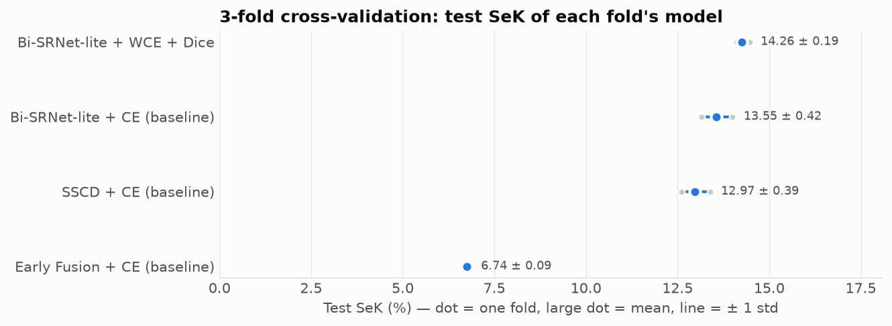

### Overfitting and underfitting

Each epoch, the model is also scored on a fixed 296-pair subset of its own training data (no
augmentation), next to the validation fold. Rules used for the diagnosis (averaged over folds):

| Diagnosis | Rule |
|---|---|
| Overfitting | validation loss ends >10% above its minimum **and** train SeK − val SeK > 3 at the last epoch |
| Mild overfitting | only one of the two conditions above |
| Underfitting (still improving) | val SeK still rising (> 0.15 per epoch over the last 5 epochs) and gap < 2 |
| Failed to learn | best val SeK < 5 |
| Good fit | none of the above |

Losses of different techniques are defined differently, so compare train and validation loss
**within** a panel, not across panels.

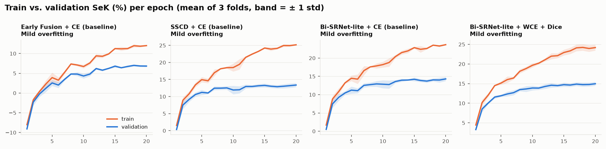

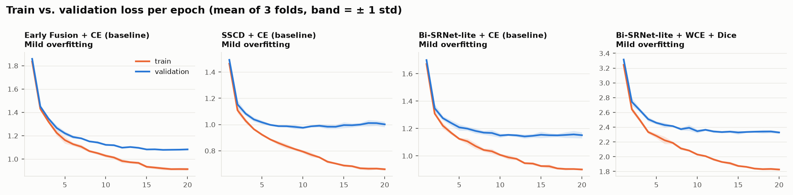

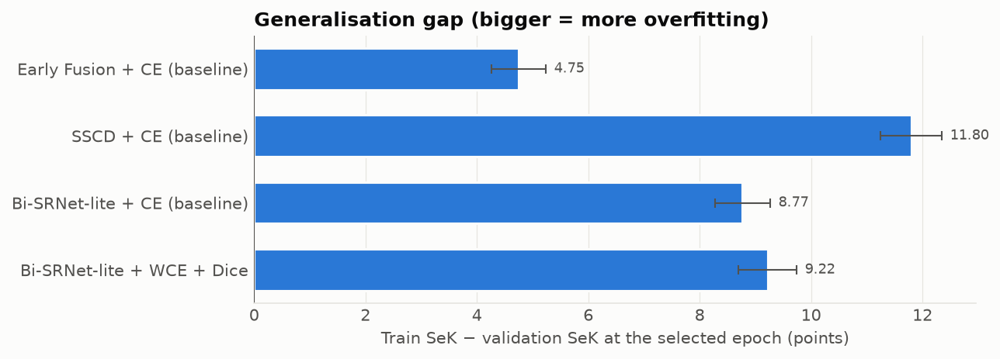

*Cross-validation still running for: B_bisrnet_dice.*

## Next steps

The full plan with time estimates is in [docs/ROADMAP.md](docs/ROADMAP.md). In short:

1. **Statistics:** finish the 3-fold cross-validation and add seeds, so every gap has a mean ± std.
2. **Cheap fixes suggested by the error analysis:** tune the change threshold (missed changes are
   the largest error), train the best configuration longer, and fix or drop OHEM.
3. **New method, a transition-aware loss:** weight each pixel by how rare its *from → to* change
   is, and compare it against CE, WCE + Dice and the SeK loss of Mamba-FCS
   [[6]](https://arxiv.org/abs/2508.08232).
4. **Published setting:** 512 px, a larger backbone and 50+ epochs on a GPU.
5. **A second dataset:** Landsat-SCD.
6. **Paper:** write it up and choose a venue.

## Reproduce

```bash
python3.11 -m venv .venv && source .venv/bin/activate
pip install -r requirements.txt
python prepare_data.py          # streams SECOND from Google Drive → data/SECOND_256 (needs bsdtar)
python analyze_imbalance.py     # → results/imbalance_stats.json
./run_all.sh                    # phase A + phase B (EPOCHS=20 by default); finished runs are skipped
./run_cv.sh                     # 3-fold cross-validation + train/val curves (~12 h on an M4)
python make_docs.py             # → README.md, docs/*.md, docs/figures/*.png
```

One run: `python train.py --model bisrnet --loss combo --sampler rare --epochs 20 --tag my_run`.

## Repository layout

| Path | Contents |
|---|---|
| [scd.py](scd.py) | Data loading, the 3 models, all losses, official SECOND metrics |
| [train.py](train.py) | Training and evaluation of a single run → `results/<tag>.json` |
| [run_all.sh](run_all.sh) | Phase A → pick best architecture → phase B |
| [prepare_data.py](prepare_data.py) | Streaming download + 256 px conversion |
| [analyze_imbalance.py](analyze_imbalance.py) | Class and transition statistics |
| [make_docs.py](make_docs.py) | Generates this README, `docs/` and all figures |
| [docs/METHODOLOGY.md](docs/METHODOLOGY.md) | Models, losses, metrics and training details |
| [docs/RESULTS.md](docs/RESULTS.md) | Every table, per run |
| [docs/DIAGNOSTICS.md](docs/DIAGNOSTICS.md) | Error breakdown, cross-validation, fold-by-fold fit diagnosis |
| [run_cv.sh](run_cv.sh) | 3-fold cross-validation of all 12 configurations |
| [docs/ENGINEERING_NOTES.md](docs/ENGINEERING_NOTES.md) | Problems hit while running on a laptop and their fixes |
| [docs/REFERENCES.md](docs/REFERENCES.md) | Paper, link and code location for every model, loss and metric |
| [docs/ROADMAP.md](docs/ROADMAP.md) | Next steps towards a paper |
| [docs/PROJECT_SUMMARY.md](docs/PROJECT_SUMMARY.md) | Short summary for supervisors and reviewers |
| [requirements.txt](requirements.txt) | Exact package versions |
| `results/` | Per-run JSON (metrics, confusion matrix, training history), CSV summary |
| `logs/` | Training logs |

## Limitations

- **One seed per configuration.** Several phase-B techniques differ by only a few tenths of SeK.
  Those gaps may change with another seed, so treat close results as ties.
- **Lower resolution and a short schedule** (256 px, 20 epochs). Absolute scores are lower than
  published ones, as the comparison above explains.
- **Simplified versions of the published models.** They follow the core ideas of HRSCD-str.2,
  SSCD-l and Bi-SRNet, but are not exact copies of those papers' code.
- **Test split taken from the public training release,** because SECOND's official test labels
  are not part of the download used here.

## References

Full table (each model, loss, optimiser and metric → paper, link, code location, our changes):
**[docs/REFERENCES.md](docs/REFERENCES.md)**. Main sources:

1. Yang et al., *Asymmetric Siamese Networks for Semantic Change Detection in Aerial Images*, IEEE TGRS 2022 — SECOND dataset and metrics. [arXiv:2010.05687](https://arxiv.org/abs/2010.05687)
2. Daudt et al., *Multitask Learning for Large-scale Semantic Change Detection*, CVIU 2019 — HRSCD strategies (Early Fusion). [arXiv:1810.08452](https://arxiv.org/abs/1810.08452)
3. Ding et al., *Bi-Temporal Semantic Reasoning for the Semantic Change Detection in HR Remote Sensing Images*, IEEE TGRS 2022 — SSCD-l, Bi-SRNet, consistency loss. [arXiv:2108.06103](https://arxiv.org/abs/2108.06103)
4. Ding et al., *Joint Spatio-Temporal Modeling for the Semantic Change Detection in Remote Sensing Images*, IEEE TGRS 2024 — SCanNet. [arXiv:2212.05245](https://arxiv.org/abs/2212.05245)
5. Chen et al., *ChangeMamba*, IEEE TGRS 2024. [arXiv:2404.03425](https://arxiv.org/abs/2404.03425)
6. *Mamba-FCS* (SeK loss; published SECOND table), 2025. [arXiv:2508.08232](https://arxiv.org/abs/2508.08232)
7. He et al., *Deep Residual Learning* (ResNet), CVPR 2016. [arXiv:1512.03385](https://arxiv.org/abs/1512.03385)
8. Lin et al., *Feature Pyramid Networks*, CVPR 2017. [arXiv:1612.03144](https://arxiv.org/abs/1612.03144)
9. Eigen & Fergus, median-frequency balancing, ICCV 2015. [arXiv:1411.4734](https://arxiv.org/abs/1411.4734)
10. Cui et al., *Class-Balanced Loss Based on Effective Number of Samples*, CVPR 2019. [arXiv:1901.05555](https://arxiv.org/abs/1901.05555)
11. Lin et al., *Focal Loss for Dense Object Detection*, ICCV 2017. [arXiv:1708.02002](https://arxiv.org/abs/1708.02002)
12. Milletari et al., *V-Net* (Dice loss), 3DV 2016. [arXiv:1606.04797](https://arxiv.org/abs/1606.04797)
13. Shrivastava et al., *Online Hard Example Mining*, CVPR 2016. [arXiv:1604.03540](https://arxiv.org/abs/1604.03540)
14. Gupta et al., *LVIS* (repeat-factor sampling), CVPR 2019. [arXiv:1908.03195](https://arxiv.org/abs/1908.03195)
15. Loshchilov & Hutter, *AdamW*, ICLR 2019. [arXiv:1711.05101](https://arxiv.org/abs/1711.05101) · Smith & Topin, *One-cycle / Super-Convergence*, 2017. [arXiv:1708.07120](https://arxiv.org/abs/1708.07120)
