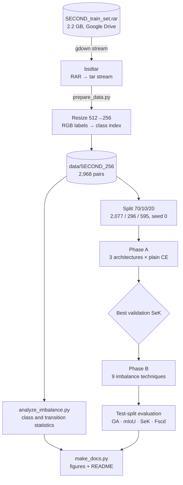
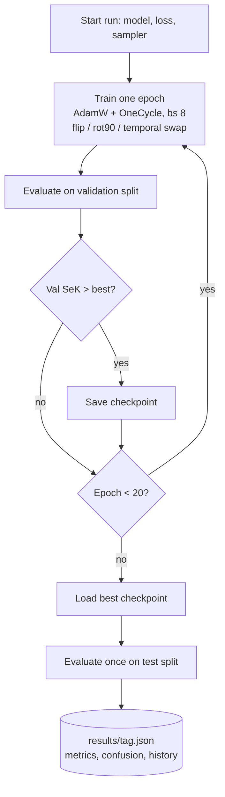
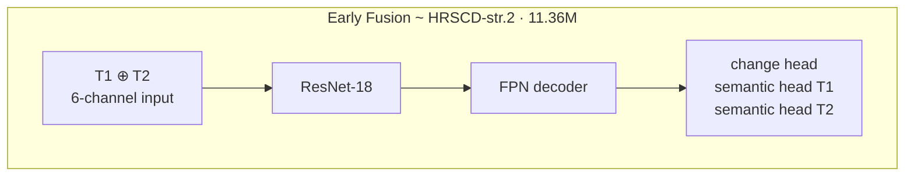
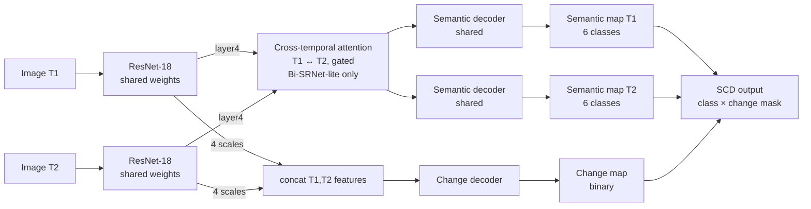
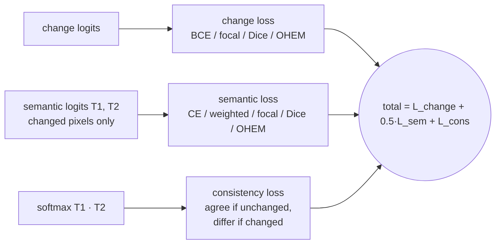

# Semantic Change Detection on SECOND: a controlled study of architectures and class imbalance

This project trains and evaluates **semantic change detection (SCD)** models on the
[SECOND](https://captain-whu.github.io/SCD/) aerial dataset. Each model answers two questions for
every pixel of a before/after image pair: *did this pixel change?* and *if so, what was it before
and what is it now?*

The project has two phases, both run under one fixed protocol so every difference in the results
comes from the thing being tested:

1. **Phase A: architecture.** Three SCD designs share the same backbone, decoder, data split,
   schedule and seed.
2. **Phase B: class imbalance.** Nine imbalance techniques are tested on the winning
   architecture.

Everything runs end to end on a 16 GB Apple M4 laptop.

**Status:** 3/9 phase-B runs complete; still running: `focal`, `dice`, `ohem`, `ce_rare`, `combo`, `combo_rare`. Re-run `make_docs.py` when they finish.

## Results at a glance

| | Test SeK | vs. Early Fusion baseline |
|---|---:|---:|
| Early Fusion + CE (starting point) | 7.97 | — |
| SSCD + CE | 13.59 | **+70.4%** |
| Bi-SRNet-lite + CE (selected architecture) | 14.24 | **+78.6%** |
| **Best overall: Bi-SRNet-lite + Weighted CE** | **14.52** | **+82.1%** |

- **Architecture matters most.** Replacing early fusion with a Siamese design raised SeK by
  70%. Adding cross-temporal attention and a semantic-consistency
  loss (Bi-SRNet-lite) raised it by another 4.8%, with only
  0.33M extra parameters.
- **Imbalance handling gives a smaller gain.** The best technique, *Weighted CE*, improves SeK by
  +2.0% over plain CE on the same architecture.
  3 of 3 techniques beat the CE baseline on SeK. 3 of 3 lower
  overall accuracy (OA): they trade some no-change pixels for more detected change.
- **Rare classes gain the most.** From the Early Fusion baseline to the best run, *water* IoU goes
  from 0.0 to 20.9 and *playground* IoU from 9.7 to
  29.8.
- **Most errors are missed changes, not wrong classes.** In the best run, 32% of changed
  pixels (averaged over the 6 classes) are predicted as *no-change*. Mixing up two land-cover
  classes is much rarer ([confusion matrix](#training-curves-and-error-analysis)). The change branch
  has more room to improve than the semantic branch.
- **The published ranking holds at lower cost.** Our runs keep the published order
  (HRSCD-str.2 < SSCD-l < Bi-SRNet) and reach 75% / 62% /
  61% of the published SeK. They use ¼ of the pixels (256 px instead of 512 px),
  a ResNet-18 backbone, 20 epochs and about 22 minutes of training per model on a laptop.


## What is different about this project

Most SCD papers propose a new network and report one number against earlier networks. This project
is a **controlled comparison** instead:

| | Typical SCD paper | This project |
|---|---|---|
| Comparison | Often against numbers reported in other papers (different code, schedules and sometimes splits) | 3 architectures, one fixed protocol: same backbone, decoder, split, seed, schedule and metric code |
| Class imbalance | Usually one loss choice, rarely compared with alternatives | Imbalance measured first (4:1 change ratio, 59× between classes, 31 transition types), then 9 techniques benchmarked |
| Balancing scope | Varies | Both branches: BCE `pos_weight`/focal/Dice/OHEM on change, class weights/Dice/focal/OHEM on semantics, plus image-level rare-class oversampling |
| Hardware | GPU training at 512 px, usually for many more epochs | One 16 GB Apple M4 laptop (MPS), 256 px, 20 epochs, ~22 min/run |
| Data handling | Download, unpack, train | 2.2 GB RAR streamed from Google Drive into a 256 px copy without writing the archive to disk; lazy PNG loading keeps RAM low |
| Reproducibility | Varies | Fixed split (seed 0), one command runs everything; docs are generated from the result files |

Design choices used in every run (standard ideas, applied consistently rather than claimed as new):

- **Temporal-swap augmentation:** T1 and T2 (and their labels) are swapped at random, so the model
  sees every change in both directions (e.g. tree → building and building → tree).
- **Cross-temporal attention with a zero-initialised gate:** training starts exactly from the SSCD
  model and learns how much attention to add.
- **Change-aware semantic loss:** semantic loss is computed only on changed pixels, as in
  Bi-SRNet, because SECOND defines semantic labels only there.
- **Model selection on a separate validation split:** checkpoints are chosen by validation SeK and
  reported once on a separate test split, so no test-set tuning.

## Pipeline



### Experiment protocol



## Models

All three share an ImageNet-pretrained **ResNet-18** encoder and an FPN-style decoder (64 channels,
stride 4).





| Model | Idea | Parameters |
|---|---|---:|
| Early Fusion | Stack T1 and T2 as 6 channels, one network, three heads | 11.36M |
| SSCD | Siamese encoder; semantic decoder per date (shared) + change decoder on concatenated features | 11.58M |
| Bi-SRNet-lite | SSCD + cross-temporal attention on the deepest features + semantic-consistency loss | 11.91M |

### Loss



## Dataset and class imbalance

SECOND has 2,968 public 512×512 image pairs with 6 land-cover classes. Labels exist only where
change happened. Only **19.9%** of pixels change (no-change : change =
4.01 : 1). Among changed pixels, the largest class is
**59×** bigger than the smallest. *Playground* appears in only
111 of 2,968 before-images.


## Results

All numbers are on the held-out **test split (595 pairs)**. Checkpoints are selected by validation
SeK. SeK is the primary metric. Full tables: [docs/RESULTS.md](docs/RESULTS.md).

### Phase A: architecture (plain CE)

| Architecture | OA | mIoU | **SeK** | Fscd | Change IoU | val SeK | best ep | train min |
|---|---:|---:|---:|---:|---:|---:|---:|---:|
| Early Fusion (HRSCD-str.2-style) | 84.15 | 63.71 | 7.97 | 46.12 | 42.51 | 8.29 | 20 | 9.5 |
| Siamese SSCD (SSCD-l-style) | 85.92 | 68.02 | 13.59 | 52.48 | 49.28 | 13.67 | 15 | 21.1 |
| **Bi-SRNet-lite (SSCD + cross-temporal attention + consistency loss)** | 85.75 | 68.65 | **14.24** | 53.36 | 50.67 | 14.48 | 16 | 22.5 |


### Phase B: class-imbalance techniques on Bi-SRNet-lite

| Technique | OA | mIoU | **SeK** | Fscd | Change IoU | val SeK | best ep | train min |
|---|---:|---:|---:|---:|---:|---:|---:|---:|
| CE (baseline) | 85.75 | 68.65 | 14.24 | 53.36 | 50.67 | 14.48 | 16 | 22.5 |
| **Weighted CE** | 84.04 | 68.42 | **14.52** | 53.01 | 51.77 | 15.62 | 19 | 22.2 |
| Median-freq | 83.13 | 68.11 | 14.36 | 51.82 | 51.86 | 14.76 | 18 | 22.6 |
| Class-balanced | 83.39 | 68.08 | 14.29 | 52.40 | 51.69 | 15.29 | 18 | 34.7 |

Relative change against the CE baseline (Δ% for metrics, percentage points for class IoU):

| Technique | ΔSeK | ΔFscd | ΔmIoU | ΔOA | ΔChange IoU | Δwater IoU | Δplayground IoU |
|---|---:|---:|---:|---:|---:|---:|---:|
| Weighted CE | +2.0% | -0.7% | -0.3% | -2.0% | +2.2% | +1.3 pt | +0.0 pt |
| Median-freq | +0.8% | -2.9% | -0.8% | -3.1% | +2.4% | -3.3 pt | -0.6 pt |
| Class-balanced | +0.3% | -1.8% | -0.8% | -2.8% | +2.0% | -0.9 pt | +1.8 pt |


### Per-class IoU


### Training curves and error analysis


### Qualitative results


*Predictions from `A_early_fusion_ce` on test pairs. Colours follow the official SECOND legend.*

### Comparison with published results

| Method | Setting | OA | mIoU | SeK | Fscd |
|---|---|---:|---:|---:|---:|
| HRSCD-str.2 | published, 512 px | 85.49 | 64.43 | 10.69 | 49.22 |
| HRSCD-str.4 | published, 512 px | 86.62 | 71.15 | 18.80 | 58.21 |
| SSCD-l | published, 512 px | 87.19 | 72.60 | 21.86 | 61.22 |
| Bi-SRNet | published, 512 px | 87.84 | 73.41 | 23.22 | 62.61 |
| SCanNet | published, 512 px | 87.86 | 73.42 | 23.94 | 63.66 |
| ChangeMamba | published, 512 px | 88.12 | 73.68 | 24.11 | 64.03 |
| **Ours: Early Fusion** | 256 px, R-18, 20 ep | 84.15 | 63.71 | **7.97** | 46.12 |
| **Ours: SSCD** | 256 px, R-18, 20 ep | 85.92 | 68.02 | **13.59** | 52.48 |
| **Ours: Bi-SRNet-lite** | 256 px, R-18, 20 ep | 85.75 | 68.65 | **14.24** | 53.36 |
| **Ours: Bi-SRNet-lite + Weighted CE** | 256 px, R-18, 20 ep | 84.04 | 68.42 | **14.52** | 53.01 |


> **This comparison is not like-for-like.** Published numbers use 512×512 images, usually larger
> backbones, longer training and their own splits. Ours use 256×256 (¼ of the pixels),
> ResNet-18, 20 epochs and a 70/10/20 split of the 2,968 public pairs. The table shows where the
> results sit, not a claim to beat those methods. The main result here is the controlled
> comparison inside this project.

## Reproduce

```bash
python3.11 -m venv .venv && source .venv/bin/activate
pip install torch torchvision numpy scipy pillow matplotlib gdown
python prepare_data.py          # streams SECOND from Google Drive → data/SECOND_256 (needs bsdtar)
python analyze_imbalance.py     # → results/imbalance_stats.json
./run_all.sh                    # phase A + phase B (EPOCHS=20 by default); finished runs are skipped
python make_docs.py             # → README.md, docs/*.md, docs/figures/*.png
```

One run: `python train.py --model bisrnet --loss combo --sampler rare --epochs 20 --tag my_run`.

## Repository layout

| Path | Contents |
|---|---|
| [scd.py](scd.py) | Data loading, the 3 models, all losses, official SECOND metrics |
| [train.py](train.py) | Training and evaluation of a single run → `results/<tag>.json` |
| [run_all.sh](run_all.sh) | Phase A → pick best architecture → phase B |
| [prepare_data.py](prepare_data.py) | Streaming download + 256 px conversion |
| [analyze_imbalance.py](analyze_imbalance.py) | Class and transition statistics |
| [make_docs.py](make_docs.py) | Generates this README, `docs/` and all figures |
| [docs/METHODOLOGY.md](docs/METHODOLOGY.md) | Models, losses, metrics and training details |
| [docs/RESULTS.md](docs/RESULTS.md) | Every table, per run |
| [docs/ENGINEERING_NOTES.md](docs/ENGINEERING_NOTES.md) | Problems hit while running on a laptop and their fixes |
| `results/` | Per-run JSON (metrics, confusion matrix, training history), CSV summary |
| `logs/` | Training logs |

## Limitations

- **One seed per configuration.** Several phase-B techniques differ by only a few tenths of SeK.
  Those gaps may change with another seed, so treat close results as ties.
- **Lower resolution and a short schedule** (256 px, 20 epochs). Absolute scores are lower than
  published ones, as the comparison above explains.
- **Simplified versions of the published models.** They follow the core ideas of HRSCD-str.2,
  SSCD-l and Bi-SRNet, but are not exact copies of those papers' code.
- **Test split taken from the public training release,** because SECOND's official test labels
  are not part of the download used here.

## References

- Yang et al., *Asymmetric Siamese Networks for Semantic Change Detection in Aerial Images*, IEEE TGRS 2021 (SECOND dataset and metrics).
- Daudt et al., *Multitask learning for large-scale semantic change detection*, CVIU 2019 (HRSCD).
- Ding et al., *Bi-Temporal Semantic Reasoning for the Semantic Change Detection in HR Remote Sensing Images*, IEEE TGRS 2022 (SSCD-l, Bi-SRNet).
- Ding et al., *Joint Spatio-Temporal Modeling for Semantic Change Detection in Remote Sensing Images*, IEEE TGRS 2024 (SCanNet).
- Chen et al., *ChangeMamba: Remote Sensing Change Detection with Spatio-Temporal State Space Model*, IEEE TGRS 2024.
- Cui et al., *Class-Balanced Loss Based on Effective Number of Samples*, CVPR 2019.
- Lin et al., *Focal Loss for Dense Object Detection*, ICCV 2017.
- Published SECOND numbers as tabulated in [Mamba-FCS (arXiv 2508.08232)](https://arxiv.org/abs/2508.08232).
