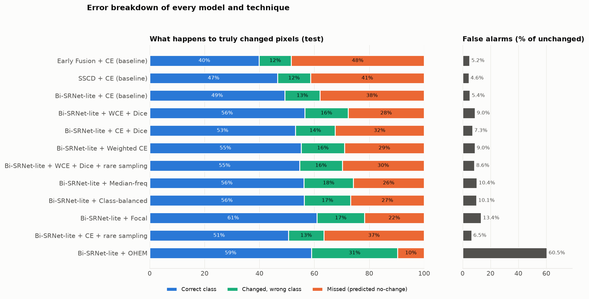
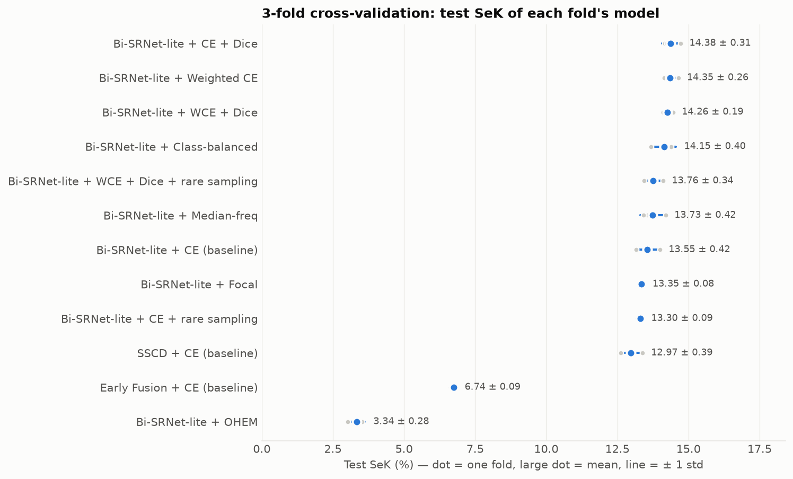
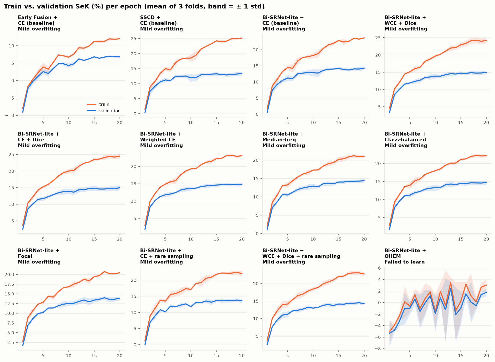
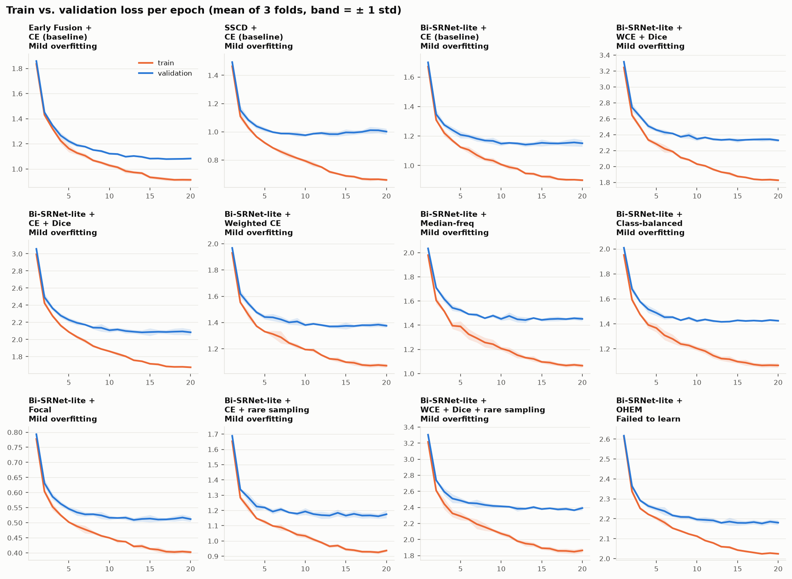
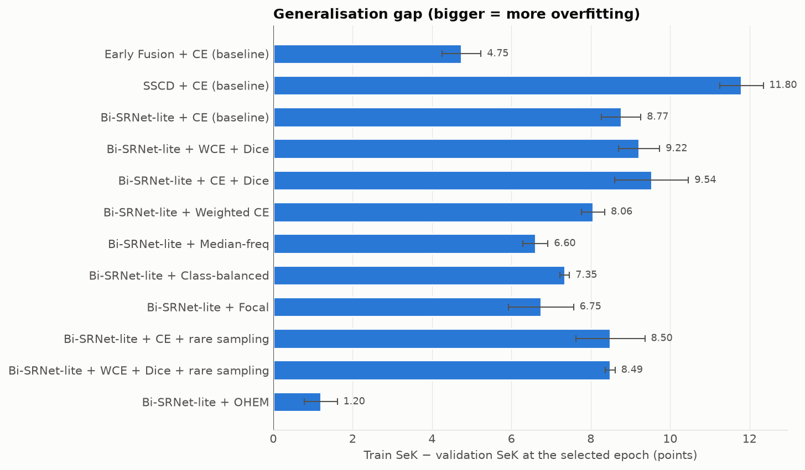

# Diagnostics: fold-by-fold

Generated by `make_docs.py` from `results/cv/*.json`.
## Summary: errors, cross-validation and fit

### Error breakdown (main runs, test split)

Every changed pixel ends up in one of three buckets: correct class, wrong class, or missed (the
model says *no-change*). Unchanged pixels that the model marks as changed are false alarms.

| Model / technique | Correct | Wrong class | Missed change | False alarm | Change precision | Change recall |
|---|---:|---:|---:|---:|---:|---:|
| Early Fusion + CE (baseline) | 39.9% | 11.7% | 48.4% | 5.2% | 70.7% | 51.6% |
| SSCD + CE (baseline) | 46.6% | 12.0% | 41.4% | 4.6% | 75.6% | 58.6% |
| Bi-SRNet-lite + CE (baseline) | 49.2% | 12.8% | 38.0% | 5.4% | 73.4% | 62.0% |
| Bi-SRNet-lite + WCE + Dice | 56.5% | 15.8% | 27.7% | 9.0% | 65.9% | 72.3% |
| Bi-SRNet-lite + CE + Dice | 53.1% | 14.5% | 32.4% | 7.3% | 69.2% | 67.6% |
| Bi-SRNet-lite + Weighted CE | 55.2% | 15.8% | 29.0% | 9.0% | 65.6% | 71.0% |
| Bi-SRNet-lite + WCE + Dice + rare sampling | 54.6% | 15.6% | 29.8% | 8.6% | 66.3% | 70.2% |
| Bi-SRNet-lite + Median-freq | 56.3% | 17.9% | 25.8% | 10.4% | 63.3% | 74.2% |
| Bi-SRNet-lite + Class-balanced | 56.3% | 16.9% | 26.7% | 10.1% | 63.7% | 73.3% |
| Bi-SRNet-lite + Focal | 60.9% | 17.4% | 21.7% | 13.4% | 58.5% | 78.3% |
| Bi-SRNet-lite + CE + rare sampling | 50.6% | 12.8% | 36.5% | 6.5% | 70.1% | 63.5% |
| Bi-SRNet-lite + OHEM | 59.0% | 31.4% | 9.6% | 60.5% | 26.5% | 90.4% |

- Missed changes are a bigger error than wrong classes in **11 of 12** runs.
- Imbalance handling finds more changes but also raises false alarms. Going from plain CE to WCE + Dice on
  Bi-SRNet-lite, change recall rises from 62.0% to
  72.3%, but change precision falls from 73.4% to
  65.9%, and false alarms go from 5.4% to
  9.0% of unchanged pixels. The net effect on SeK is still positive
  (14.24 → 15.38).
- OHEM shows the extreme end of this trade: 60% false alarms.

### Cross-validation (3-fold)

The 2,373 train+validation pairs are split into 3
folds (1,582 train / 791 validation per fold). The 595-pair test split is
never used for training or model selection. Each fold's best-validation model is scored on it.
Because each fold trains on fewer pairs than the main runs (2,077), CV scores are a little lower;
they are used to measure **stability and ranking**, not to replace the main-table numbers.

- **Best by cross-validation:** Bi-SRNet-lite + CE + Dice, test SeK 14.38 ± 0.31 over 3 folds.
- Against plain CE on the same model it wins in **3 of 3 folds** (mean +0.83 SeK, std 0.22). The gain is consistent across folds.
- Fit diagnosis: 11× mild overfitting, 1× failed to learn.

| Model / technique | Val SeK | **Test SeK** | Test Fscd | Train SeK | Gap (train−val) | Val-loss rise | Diagnosis | Beats reference in |
|---|---:|---:|---:|---:|---:|---:|---|---|
| Bi-SRNet-lite + CE + Dice | 14.97 ± 0.88 | **14.38 ± 0.31** | 53.68 ± 0.41 | 24.51 ± 0.78 | 9.54 ± 0.93 | 0.4% | Mild overfitting | 3/3 folds (+0.83) |
| Bi-SRNet-lite + Weighted CE | 14.89 ± 0.55 | **14.35 ± 0.26** | 52.90 ± 0.31 | 22.95 ± 0.65 | 8.06 ± 0.29 | 0.9% | Mild overfitting | 3/3 folds (+0.80) |
| Bi-SRNet-lite + WCE + Dice | 14.96 ± 0.62 | **14.26 ± 0.19** | 52.77 ± 0.25 | 24.18 ± 0.91 | 9.22 ± 0.52 | 0.3% | Mild overfitting | 3/3 folds (+0.70) |
| Bi-SRNet-lite + Class-balanced | 14.75 ± 0.67 | **14.15 ± 0.40** | 52.46 ± 0.57 | 22.09 ± 0.58 | 7.35 ± 0.12 | 0.9% | Mild overfitting | 3/3 folds (+0.60) |
| Bi-SRNet-lite + WCE + Dice + rare sampling | 14.53 ± 0.49 | **13.76 ± 0.34** | 52.29 ± 0.66 | 23.02 ± 0.59 | 8.49 ± 0.13 | 1.3% | Mild overfitting | 3/3 folds (+0.20) |
| Bi-SRNet-lite + Median-freq | 14.40 ± 0.60 | **13.73 ± 0.42** | 51.46 ± 0.60 | 21.00 ± 0.54 | 6.60 ± 0.32 | 1.3% | Mild overfitting | 3/3 folds (+0.18) |
| Bi-SRNet-lite + CE (baseline) | 14.39 ± 0.54 | **13.55 ± 0.42** | 52.79 ± 0.52 | 23.16 ± 1.03 | 8.77 ± 0.49 | 0.8% | Mild overfitting | 3/3 folds (+6.81) |
| Bi-SRNet-lite + Focal | 13.99 ± 0.52 | **13.35 ± 0.08** | 51.88 ± 0.22 | 20.73 ± 0.32 | 6.75 ± 0.82 | 1.0% | Mild overfitting | 1/3 folds (-0.20) |
| Bi-SRNet-lite + CE + rare sampling | 13.88 ± 0.74 | **13.30 ± 0.09** | 52.46 ± 0.25 | 22.38 ± 0.73 | 8.50 ± 0.87 | 1.3% | Mild overfitting | 1/3 folds (-0.25) |
| SSCD + CE (baseline) | 13.38 ± 0.73 | **12.97 ± 0.39** | 51.67 ± 0.50 | 25.17 ± 0.18 | 11.80 ± 0.55 | 2.8% | Mild overfitting | 3/3 folds (+6.23) |
| Early Fusion + CE (baseline) | 7.03 ± 0.28 | **6.74 ± 0.09** | 44.44 ± 0.64 | 11.78 ± 0.37 | 4.75 ± 0.49 | 0.4% | Mild overfitting | — (reference) |
| Bi-SRNet-lite + OHEM | 3.33 ± 0.56 | **3.34 ± 0.28** | 33.72 ± 5.31 | 4.53 ± 0.15 | 1.20 ± 0.42 | 0.2% | Failed to learn | 0/3 folds (-10.21) |

### Overfitting and underfitting

Each epoch, the model is also scored on a fixed 296-pair subset of its own training data (no
augmentation), next to the validation fold. Rules used for the diagnosis (averaged over folds):

| Diagnosis | Rule |
|---|---|
| Overfitting | validation loss ends >10% above its minimum **and** train SeK − val SeK > 3 at the last epoch |
| Mild overfitting | only one of the two conditions above |
| Underfitting (still improving) | val SeK still rising (> 0.15 per epoch over the last 5 epochs) and gap < 2 |
| Failed to learn | best val SeK < 5 |
| Good fit | none of the above |

Losses of different techniques are defined differently, so compare train and validation loss
**within** a panel, not across panels.

## Per fold

### Early Fusion + CE (baseline)

| fold | best epoch | train SeK | val SeK | test SeK | gap at end | val-loss rise | val-SeK slope (last 5 ep) |
|---:|---:|---:|---:|---:|---:|---:|---:|
| 0 | 17 | 11.65 | 6.74 | 6.65 | 5.57 | 0.6% | +0.05 |
| 1 | 18 | 12.20 | 7.07 | 6.77 | 5.27 | 0.4% | +0.12 |
| 2 | 15 | 11.49 | 7.29 | 6.82 | 4.70 | 0.2% | +0.12 |

### SSCD + CE (baseline)

| fold | best epoch | train SeK | val SeK | test SeK | gap at end | val-loss rise | val-SeK slope (last 5 ep) |
|---:|---:|---:|---:|---:|---:|---:|---:|
| 0 | 20 | 25.21 | 13.55 | 13.39 | 11.66 | 2.6% | +0.08 |
| 1 | 20 | 24.98 | 12.57 | 12.92 | 12.40 | 4.1% | +0.06 |
| 2 | 20 | 25.34 | 14.00 | 12.61 | 11.33 | 1.5% | +0.17 |

### Bi-SRNet-lite + CE (baseline)

| fold | best epoch | train SeK | val SeK | test SeK | gap at end | val-loss rise | val-SeK slope (last 5 ep) |
|---:|---:|---:|---:|---:|---:|---:|---:|
| 0 | 20 | 23.79 | 14.66 | 14.00 | 9.13 | 0.5% | +0.10 |
| 1 | 14 | 21.97 | 13.77 | 13.49 | 9.97 | 1.6% | +0.01 |
| 2 | 20 | 23.72 | 14.75 | 13.16 | 8.98 | 0.4% | +0.23 |

### Bi-SRNet-lite + WCE + Dice

| fold | best epoch | train SeK | val SeK | test SeK | gap at end | val-loss rise | val-SeK slope (last 5 ep) |
|---:|---:|---:|---:|---:|---:|---:|---:|
| 0 | 20 | 23.93 | 15.20 | 14.47 | 8.73 | 0.1% | +0.12 |
| 1 | 20 | 23.41 | 14.26 | 14.10 | 9.16 | 0.1% | +0.02 |
| 2 | 20 | 25.19 | 15.43 | 14.20 | 9.77 | 0.7% | +0.03 |

### Bi-SRNet-lite + CE + Dice

| fold | best epoch | train SeK | val SeK | test SeK | gap at end | val-loss rise | val-SeK slope (last 5 ep) |
|---:|---:|---:|---:|---:|---:|---:|---:|
| 0 | 20 | 23.93 | 15.44 | 14.73 | 8.49 | 0.3% | +0.09 |
| 1 | 20 | 24.21 | 13.96 | 14.17 | 10.25 | 0.9% | +0.03 |
| 2 | 20 | 25.39 | 15.52 | 14.23 | 9.87 | 0.1% | +0.15 |

### Bi-SRNet-lite + Weighted CE

| fold | best epoch | train SeK | val SeK | test SeK | gap at end | val-loss rise | val-SeK slope (last 5 ep) |
|---:|---:|---:|---:|---:|---:|---:|---:|
| 0 | 20 | 23.47 | 15.08 | 14.65 | 8.39 | 1.2% | +0.09 |
| 1 | 16 | 22.22 | 14.26 | 14.26 | 8.45 | 0.6% | -0.04 |
| 2 | 20 | 23.14 | 15.32 | 14.14 | 7.83 | 1.0% | -0.00 |

### Bi-SRNet-lite + Median-freq

| fold | best epoch | train SeK | val SeK | test SeK | gap at end | val-loss rise | val-SeK slope (last 5 ep) |
|---:|---:|---:|---:|---:|---:|---:|---:|
| 0 | 20 | 20.91 | 14.68 | 14.21 | 6.24 | 0.3% | +0.19 |
| 1 | 19 | 20.51 | 13.71 | 13.57 | 6.81 | 1.3% | +0.03 |
| 2 | 20 | 21.58 | 14.80 | 13.42 | 6.78 | 2.4% | +0.01 |

### Bi-SRNet-lite + Class-balanced

| fold | best epoch | train SeK | val SeK | test SeK | gap at end | val-loss rise | val-SeK slope (last 5 ep) |
|---:|---:|---:|---:|---:|---:|---:|---:|
| 0 | 20 | 22.36 | 14.97 | 14.37 | 7.39 | 0.3% | +0.12 |
| 1 | 17 | 21.43 | 13.99 | 14.38 | 7.67 | 1.3% | +0.00 |
| 2 | 20 | 22.49 | 15.28 | 13.69 | 7.21 | 1.2% | +0.02 |

### Bi-SRNet-lite + Focal

| fold | best epoch | train SeK | val SeK | test SeK | gap at end | val-loss rise | val-SeK slope (last 5 ep) |
|---:|---:|---:|---:|---:|---:|---:|---:|
| 0 | 17 | 20.43 | 14.36 | 13.34 | 5.93 | 0.8% | +0.06 |
| 1 | 17 | 21.06 | 13.40 | 13.44 | 7.55 | 1.6% | -0.02 |
| 2 | 17 | 20.71 | 14.20 | 13.27 | 6.28 | 0.7% | -0.02 |

### Bi-SRNet-lite + CE + rare sampling

| fold | best epoch | train SeK | val SeK | test SeK | gap at end | val-loss rise | val-SeK slope (last 5 ep) |
|---:|---:|---:|---:|---:|---:|---:|---:|
| 0 | 19 | 23.16 | 13.82 | 13.34 | 9.33 | 0.7% | +0.11 |
| 1 | 19 | 21.72 | 13.18 | 13.20 | 8.16 | 2.3% | -0.04 |
| 2 | 16 | 22.25 | 14.65 | 13.37 | 7.87 | 0.9% | -0.06 |

### Bi-SRNet-lite + WCE + Dice + rare sampling

| fold | best epoch | train SeK | val SeK | test SeK | gap at end | val-loss rise | val-SeK slope (last 5 ep) |
|---:|---:|---:|---:|---:|---:|---:|---:|
| 0 | 17 | 23.42 | 14.93 | 14.12 | 8.58 | 0.3% | +0.04 |
| 1 | 19 | 22.34 | 13.98 | 13.72 | 8.27 | 2.0% | +0.04 |
| 2 | 19 | 23.29 | 14.67 | 13.44 | 8.54 | 1.7% | +0.06 |

### Bi-SRNet-lite + OHEM

| fold | best epoch | train SeK | val SeK | test SeK | gap at end | val-loss rise | val-SeK slope (last 5 ep) |
|---:|---:|---:|---:|---:|---:|---:|---:|
| 0 | 20 | 4.39 | 2.74 | 3.02 | 1.66 | 0.1% | +0.90 |
| 1 | 14 | 4.50 | 3.39 | 3.48 | 1.65 | 0.4% | +0.07 |
| 2 | 17 | 4.68 | 3.85 | 3.52 | 0.40 | 0.2% | -0.43 |
